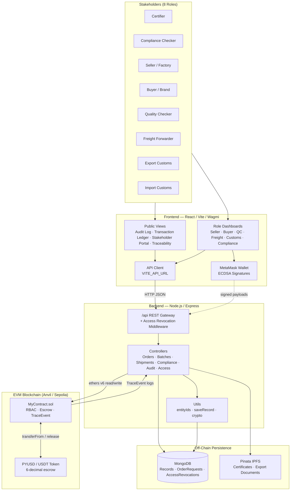
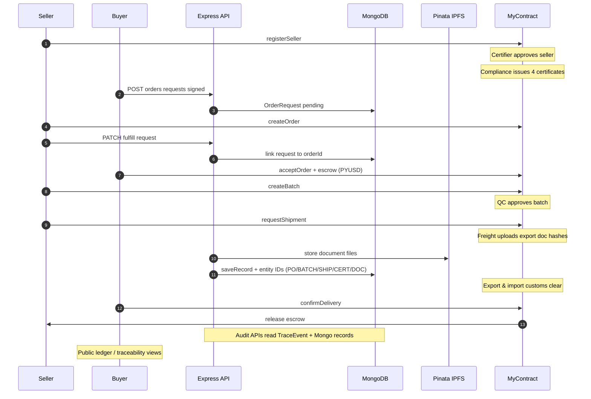
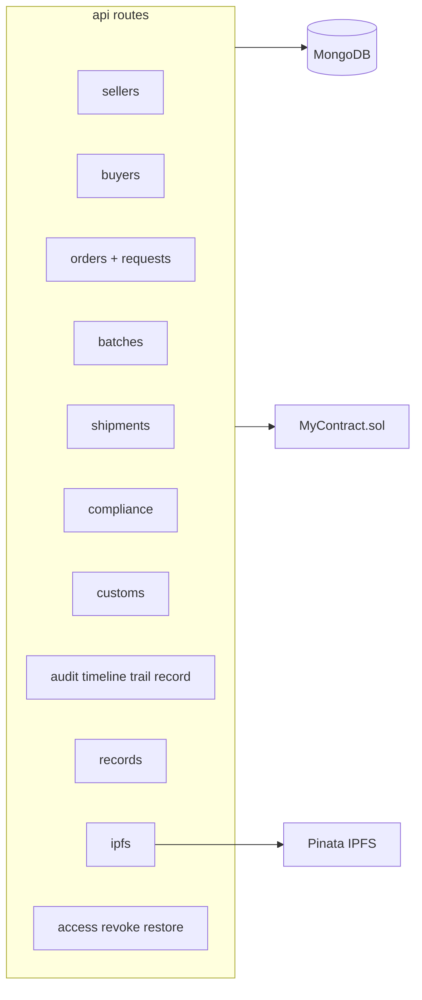

# Blockchain Unified Platform for the RMG Sector in Bangladesh

## Overview

This repository contains a full-stack blockchain workflow platform for the Ready-Made Garment (RMG) export ecosystem in Bangladesh.

The platform combines:

- Solidity smart contract state enforcement (roles, compliance gates, escrow, lifecycle status)
- Express + MongoDB backend services (signature verification, record persistence, API orchestration)
- React frontend dashboards for each role in the supply chain

The system is designed around three goals:

- Trust: immutable state transitions and role-gated actions
- Compliance: mandatory certification and export document checks
- Traceability: full lifecycle auditability from registration to settlement


## Current Token Model

The active escrow model is configured for PYUSD-style behavior (6 decimals).

Important compatibility note:

- Environment keys still use historical USDT naming:
   - USDT_ADDRESS (backend/root)
   - VITE_USDT_ADDRESS (frontend)
- These keys now point to the configured PYUSD contract address used by the system.


## Architecture

### System Architecture Diagram



### End-to-End Workflow (Hybrid On-Chain + Off-Chain)



### Component Map (API Domains)



### 1) On-chain Layer (Solidity)

Core contract: src/MyContract.sol

Responsibilities:

- Seller and buyer registration
- Role-based authorization (certifier, QC, freight, customs, compliance checker)
- Order creation and buyer acceptance with escrow transferFrom
- Batch creation with compliance gate
- Quality check, shipment request, document anchoring, customs clearances
- Escrow release on delivery confirmation (or force-release by import customs)
- TraceEvent emission for audit trail

### 2) Backend Layer (Node.js/Express/MongoDB)

Core server: backend/server.js

Responsibilities:

- API surface under /api
- Signature verification for user payloads
- Contract interaction via ethers v6
- Record persistence for fast dashboard hydration and audit queries
- Fallback status reconstruction when event log retrieval is constrained by RPC providers

### 3) Frontend Layer (React/Vite)

Core app: frontend/src/App.jsx

Responsibilities:

- Wallet-based role routing and guarded pages
- Role dashboards: Seller, Buyer, Certifier, Compliance, QC, Freight, Customs
- Traceability and ledger-style operational visibility
- API-driven status synchronization with optimistic UI updates


## Role Matrix

- Certifier: approves/rejects seller onboarding
- Compliance Checker: issues/revokes compliance certificates
- Seller: creates orders, batches, shipment requests
- Buyer: accepts orders, escrows funds, confirms delivery
- Quality Checker: approves/rejects batches
- Freight Forwarder: uploads shipment documents
- Export Customs: export verification
- Import Customs: import verification and emergency escrow release


## End-to-End Lifecycle

1. Seller registration
2. Buyer registration
3. Seller approval by certifier
4. Compliance certificate issuance
5. Order creation by seller
6. Order acceptance by buyer with escrow lock
7. Batch creation by seller
8. QC approval/rejection
9. Shipment request
10. Export document uploads
11. Export customs clearance
12. Import customs clearance
13. Buyer delivery confirmation (or force-release)
14. Escrow release to seller


## Repository Layout

```text
.
├── src/                         # Solidity contracts
│   ├── MyContract.sol
│   └── MockUSDT.sol             # optional local/mock token utilities
├── script/
│   └── Deploy.s.sol             # Foundry deployment script
├── backend/
│   ├── server.js
│   ├── controllers/
│   ├── routes/
│   ├── models/
│   ├── abi/
│   └── tests/
├── frontend/
│   ├── src/pages/
│   ├── src/hooks/
│   ├── src/api/
│   └── src/config/
├── deploy.sh                    # build + deploy + env + ABI sync
├── reset_and_test.sh            # local reset and scripted e2e flow
├── foundry.toml
└── remappings.txt
```


## Prerequisites

- Node.js 18+
- npm
- Foundry (forge, cast, anvil)
- MongoDB instance (local or Atlas)
- MetaMask or compatible EVM wallet


## Installation

```bash
git clone https://github.com/TheOnlyNaimur/Blockchain-in-RMG-sector-of-Bangladesh.git
cd Blockchain-in-RMG-sector-of-Bangladesh

cd backend && npm install
cd ../frontend && npm install
cd ..
```


## Environment Configuration

Use .env.example as a template and configure three scopes:

1. Root .env

- PRIVATE_KEY
- RPC_URL
- USDT_ADDRESS
- role addresses
- CONTRACT_ADDRESS (auto-filled by deploy.sh)

2. backend/.env

- RPC_URL, CONTRACT_ADDRESS
- MONGO_URI
- BACKEND_PRIVATE_KEY
- role private keys
- pinning/IPFS credentials

3. frontend/.env

- VITE_CONTRACT_ADDRESS
- VITE_USDT_ADDRESS
- VITE_CHAIN_ID, VITE_RPC_URL
- role addresses


## Deploy Contracts and Sync App Config

Recommended path:

```bash
./deploy.sh
```

The script performs:

- forge build
- forge script deployment
- contract address extraction from Foundry broadcast
- root/backend/frontend env updates
- backend ABI refresh (backend/abi/MyContract.json)


## Run the Platform

### Backend

```bash
cd backend
npm run dev
```

### Frontend

```bash
cd frontend
npm run dev
```

### 5. Metamask Wallet Tethering
1. Open MetaMask. Go to Settings -> Networks -> Add Network Manually.
2. Network Name: **Anvil Local**
3. New RPC URL: `http://127.0.0.1:8545`
4. Chain ID: `31337`
5. Currency Symbol: `ETH`
6. Once saved, import Account #1 and Account #2 from your `anvil` terminal output via their raw Private Keys to test the Buyer and Seller transactions.

---

## 🎭 Roles & Permissions (RBAC)

The entire system strictly operates dynamically based on which active Wallet is connected. Random addresses have zero authorization to manipulate state.

| Role                  | Workflow Capabilities                                                     |
| --------------------- | ------------------------------------------------------------------------- |
| **Certifier**         | Approves/Rejects initial Factory Registrations & Tax IDs.                 |
| **Compliance Checker**| Evaluates & issues mandatory certificates (Fire, Labor, Environment).      |
| **Seller/Factory**    | Submits KYC, creates RMG Batches, requests container shipments.           |
| **Buyer/Brand**       | Deposits USDT into escrow, dictates Batch requirements, confirms delivery.|
| **Quality Checker**   | Audits physical garments and digitally signs `QC_PASSED` or `QC_FAILED`.  |
| **Freight Forwarder** | Uploads IPFS transit documents & anchors them onto immutable ledger.      |
| **Export Customs**    | Evaluates out-bound freight and issues blockchain export clearance.       |
| **Import Customs**    | Evaluates in-bound freight, triggers final clearance & releases Escrow.   |

---

## 🔄 The Complete Production Flow & Estimated Transaction Costs

The system relies on an immutable on-chain backend. Because operations manipulate state to ensure cryptographic trust, each step incurs a standard EVM block-space execution cost (Gas). 

> *Note: Gas estimations below are approximated from deterministic execution profiling. USD mappings (if calculated) scale dynamically based on the parent EVM Chain used (e.g. Polygon, Arbitrum, Ethereum L1) and current Gas/Gwei averages.*

| Phase | Step | Actor / Role | Blockchain Event / Action | Est. Gas Used | EVM Native Cost Estimate |
|:---|:---|:---|:---|---:|---:|
| **1. Factory Enrollment** | KYC Submission | Seller/Factory | `SellerRegistered` (ECDSA signed profile mapping) | ~97,094 | Low |
| | Registration Approval | Certifier | `SellerApproved` (Changes Factory state to *Approved*) | ~57,173 | Very Low |
| **2. ESG Compliance** | Safety Verifications | Compliance Checker | `ComplianceIssued` (e.g., Fire, Building, Labor, Env.) | ~97,496 / cert | Low |
| **3. Deal Initialization** | Purchase Order Mapping | Buyer/Brand | `OrderCreated` (Locks escrow, maps HS codes & terms) | ~190,487 | Medium |
| | Anchoring Agreements | API Relayer | `AgreementGenerated` (Anchors IPFS metadata) | ~83,269 | Low |
| **4. Manufacturing Base** | Production Batching | Seller/Factory | `BatchCreated` (Mints tracking id for raw garments) | ~138,068 | Medium |
| **5. Auditing Phase** | Quality Control Check | Quality Checker | `BatchQualityUpdated` (Pass/Fail deterministic flag) | ~36,413 | Very Low |
| **6. Export Logistics** | Freight Handshake | Factory / Forwarder | `ShipmentRequested` (Links batch to logistics carrier) | ~139,331 | Medium |
| | Shipping Docs Upload | Freight Forwarder | `ExportDocUploaded` (IPFS hashes of BoL, Invoices) | ~66,494 / doc | Low |
| **7. Final Clearance** | Export Validation | Export Customs | `CustomsCleared` (Verifies physical departure) | ~90,500 | Low |
| | Import & Settlement | Import Customs | `CustomsCleared` / `PaymentReleased` (Escrow unlock)| ~150,000 | Medium |

### Step-by-Step Flow Outline:
1. **KYC Submissions**: The Seller executes KYC protocols via digital signature.
2. **Platform Approval**: The Certifier validates the credentials and triggers `approve` on-chain.
3. **Compliance Safety**: The Compliance Checker manually inputs safety certificates via IPFS (Pinata). The system natively blocks any factory without Building, Labor, Fire, & Environmental safety certificates from doing business.
4. **Purchase Order**: The Buyer can initiate a purchase request off-chain (signed). The Seller then creates the on-chain order. Finally, the Buyer accepts the order and locks USDT into escrow on-chain.
5. **Manufacturing**: Once escrow is locked, the Seller begins physical manufacturing and generates a cryptographic "Batch" linked to the Order.
6. **QC Authority Review**: The third-party Quality Checker inspects the physical goods, and cross-references the dataset on-chain. They approve/reject.
7. **Logistics Handshake**: The Seller passes the goods to the Freight Forwarder, who uploads the Bill of Lading and Certificate of Origin hashes onto IPFS, binding the CID hashes onto the EVM ledger.
8. **Public Ledger**: Any transaction, document hash, and receipt is immediately pushed to the **Public Transaction Ledger**, accessible to all users for complete transparency without needing to authenticate or connect a web3 wallet.
8. **Export / Import Gateways**: Local Bangladesh Customs flags it as `Export cleared`, and Receiving Customs flags it as `Import Cleared`.
9. **Execution & Release**: The Buyer reviews arrival status. When delivery is confirmed mutually on-chain, the frozen USDT escrow is atomically funneled into the Seller's address.
10. **Traceability Finality**: Every single execution is logged on-chain via `TraceEvent` and visualized in the `TraceabilityDashboard`. Users can download the audit trail as a PDF with verifiable timestamps.

---

## 🤖 Automated End-To-End Testing

Don't want to click through 15 wallets natively? We wrote a script that literally validates, compiles, and simulates the entire cycle via Node cryptography.

### Optional local chain (Anvil)

```bash
anvil
```

```bash
cd backend
node e2e_test.js
```


## Key API Domains

- /api/sellers
- /api/buyers
- /api/orders
- /api/batches
- /api/shipments
- /api/compliance
- /api/records
- /api/audit


## Data Integrity Model

The backend stores normalized event records in MongoDB using recordType, txHash, block metadata, rawData, and dataHash.

This supports:

- Efficient dashboard reads
- Historical audit trails
- Integrity checks against on-chain outcomes


## Operational Notes

### RPC log range limits

Some public RPC providers reject very wide eth_getLogs ranges.

The backend includes:

- bounded event query windows
- DB-backed fallback reconstruction for order/batch statuses

This is required for stable dashboard state in production-like public RPC conditions.

### Status hydration

Order status in the API is reconstructed from both live events and persisted records with cross-linking:

- batchId -> orderId
- shipId -> orderId

This ensures buyer/seller/QC/freight/customs dashboards remain consistent even during RPC event-query failures.


## Testing

### Smart contract build

```bash
forge build
```

### Backend tests

```bash
cd backend
npm test
```

### Local scripted flow

```bash
chmod +x reset_and_test.sh
./reset_and_test.sh
```


## Troubleshooting

### forge-std import not found in editor

If script/Deploy.s.sol shows:

Source forge-std/Script.sol not found

Ensure:

- foundry.toml includes forge-std remapping
- remappings.txt exists with forge-std path
- lib/forge-std is present
- Reload VS Code window after remapping updates

### Dashboard status appears stale

- Confirm backend is restarted after controller changes
- Verify /api/orders and /api/batches/events return success payloads
- Check RPC endpoint health and block-range restrictions


## Security Notes

- Role-restricted contract calls enforced on-chain
- User payload signature verification in backend
- Custom errors mapped to user-readable API responses
- Data hash persistence for tamper detection


## Academic Scope

This project is a research/prototype implementation for the Bangladesh RMG trade domain.
It is not a final audited production system and should undergo full smart contract and infrastructure security review before real-world deployment.

